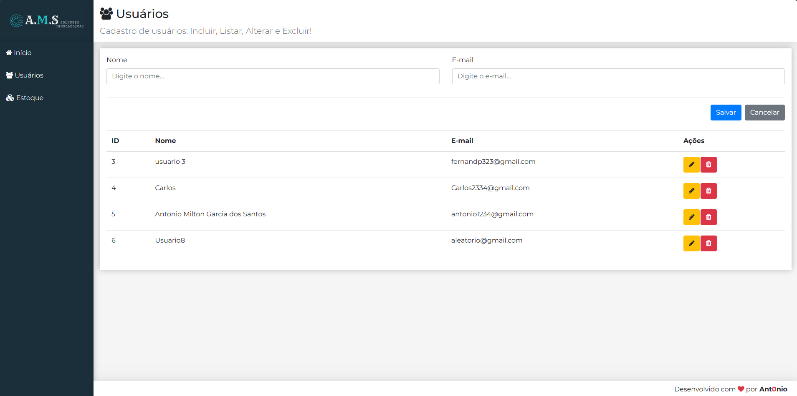

# CRUD

    DESKTOP.

    

    

    

✔️ Responsivo para Smartphones e Tablets!

    IPHONE 12 PRO.

    

     

    IPAD PRO
 

    

## 🚀 Tecnologias

Esse projeto foi desenvolvido com as seguintes tecnologias:

- HTML
- CSS
- JavaScript
- React.js

## 🚀 Desenvolvido

- Sistema de Cadastro de Usuarios e Gerenciamento de Estoque.

## Comandos

> Para baixar as dependencias e executar!!!

- cd frontend
- npm i
- npm start

> Em outro terminal.

- cd backend
- npm i
- npm start 

📩 Contato
antoniomiltonaa19@gmail.com
